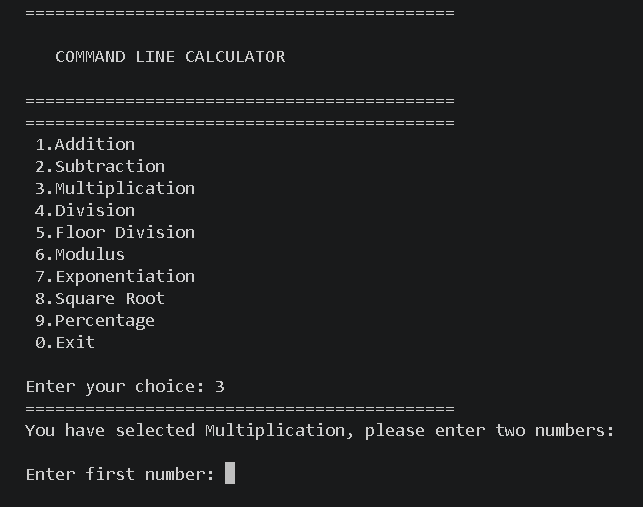
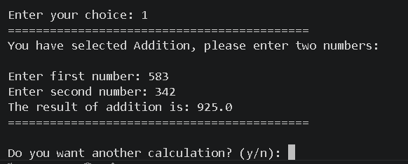
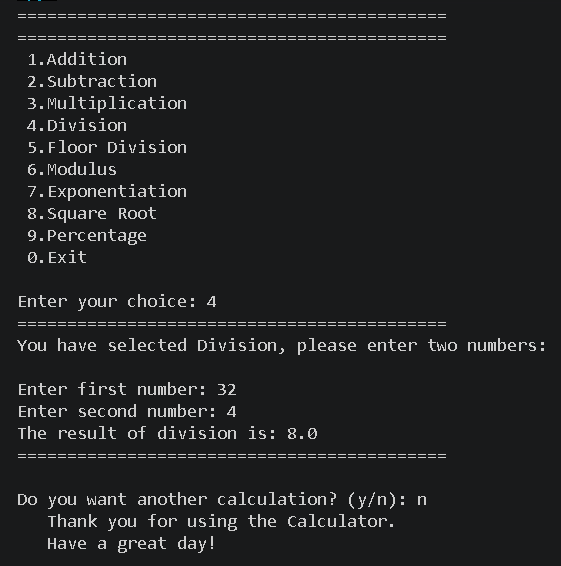

<div align="center">

# 🧮 Command Line Calculator

### A clean, beginner-friendly calculator built with core Python


A simple, menu-driven calculator that runs entirely in the terminal — my first complete Python project.

</div>

---

## 📖 Overview

**Command Line Calculator** is a terminal-based calculator written in pure Python, with no external dependencies. It supports nine mathematical operations through a numbered menu, validates every input it receives, and keeps running until the user chooses to exit.

I built it as my first complete project to practice core Python fundamentals — functions, loops, conditionals, and exception handling — by combining them into one working tool instead of learning them in isolation.

---

## ✨ Features

- ➕ Addition
- ➖ Subtraction
- ✖️ Multiplication
- ➗ Division (with divide-by-zero protection)
- 🔢 Floor Division (with divide-by-zero protection)
- 🔁 Modulus (with divide-by-zero protection)
- 📈 Exponentiation
- √ Square Root (with negative-number protection)
- 💯 Percentage Calculation
- 🔄 Repeat calculations without restarting the program
- 🚪 Clean exit option from the main menu
- ✅ Input validation on every numeric and menu entry

---

## 🛠️ Technologies Used

- **Python 3** — the entire project is written in standard Python
- **`math`** — Python's built-in standard library module, used for the square root operation

No third-party packages or `pip install` requirements — the project runs with a standard Python installation.

---

## 📁 Project Structure

```
command-line-calculator/
│
├── calculator.py          # Main application file — all program logic
├── README.md              # Project documentation (this file)
├── LICENSE                # MIT License
└── screenshots/           # Screenshots used in this README
    ├── Menu.png
    ├── Addition.png
    └── division.png
```

> **Note:** Adjust the filename above (`calculator.py`) if your script is named differently in the repository.

---

## ⚙️ Installation

Clone the repository to your local machine:

```bash
git clone https://github.com/Ahtsham9116/command-line-calculator.git
cd command-line-calculator
```

No additional installation steps are required — the project uses only Python's standard library.

**Requirements:**
- Python 3.6 or higher (required for f-string formatting used in the code)

---

## ▶️ How to Run

Run the script directly from your terminal:

```bash
python command-line-calculator.py
```

On some systems (macOS/Linux), you may need to use `python3` instead:

```bash
python3 command-line-calculator.py
```

---

## 🧮 Example Usage

When you run the program, you'll see a numbered menu of operations:

```
===========================================
 1.Addition
 2.Subtraction
 3.Multiplication
 4.Division
 5.Floor Division
 6.Modulus
 7.Exponentiation
 8.Square Root
 9.Percentage
 0.Exit

Enter your choice: 1
===========================================
You have selected Addition, please enter two numbers:

Enter first number: 583
Enter second number: 342
The result of addition is: 925.0
===========================================

Do you want another calculation? (y/n): n
   Thank you for using the Calculator.
   Have a great day!
```

After every calculation, the program asks whether you'd like to perform another one — allowing multiple calculations in a single session without restarting the script.

---

## 🖼️ Screenshots

**Main Menu**


**Addition**


**Division**


---

## 🛡️ Error Handling

The calculator validates input at every step and avoids crashing on common mistakes:

| Scenario | Behavior |
|---|---|
| Invalid menu choice (e.g. letters, out-of-range numbers) | Displays an error message and re-shows the menu |
| Invalid numeric input (non-numeric text) | Re-prompts the user until a valid number is entered |
| Division by zero | Blocked with a clear error message |
| Floor division by zero | Blocked with a clear error message |
| Modulus by zero | Blocked with a clear error message |
| Negative number for square root | Blocked with a clear error message |

This is handled through two reusable input functions — `get_int_input()` and `get_float_input()` — which wrap user input in a loop with exception handling, so invalid entries never crash the program.

---

## 📚 What I Learned

This project was my first time combining core Python concepts into one working program rather than practicing them separately:

- Variables, loops, and conditional statements (`if` / `elif` / `else`)
- Writing and reusing functions instead of repeating code
- Exception handling with `try` / `except`
- Validating and safely reading user input
- Using a standard library module (`math`)
- Structuring a program into clear, readable sections

The biggest lesson was that most of the real complexity in a "simple" calculator comes from handling what users *shouldn't* enter, not what they should. Writing `get_int_input()` and `get_float_input()` once — instead of repeating the same validation logic nine times — also made the program much easier to read and maintain, which taught me the value of reusable functions early on.

---

## 🚀 Future Improvements

- 🕘 Calculation history within a session
- 🔬 Additional scientific functions (trigonometry, logarithms, etc.)
- 🖥️ A graphical interface using Tkinter
- 💾 Saving calculation history to a file
- 🧪 Automated unit tests for each operation and edge case
- 🎨 A more polished terminal interface

---

## 👤 Author

**Muhammad Ahtsham Javed**

- GitHub: [@Ahtsham9116](https://github.com/Ahtsham9116)
- LinkedIn: [m-ahtsham-javed](https://www.linkedin.com/in/m-ahtsham-javed)
- Repository: [command-line-calculator](https://github.com/Ahtsham9116/command-line-calculator)

Feel free to explore the code, fork the repository, or reach out with suggestions.

---

## 📄 License

This project is licensed under the **MIT License** — see the [LICENSE](LICENSE) file for details.

---

<div align="center">

⭐ If you found this project useful or interesting, consider giving it a star on GitHub!

</div>
